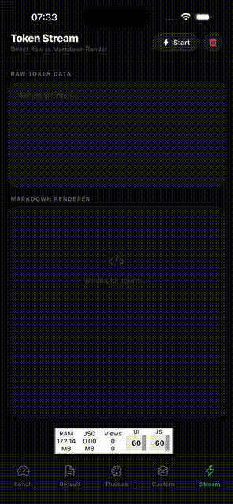

<p align="center">
  
  
</p>

# react-native-nitro-markdown 🚀

> The fastest Markdown parser for React Native. Period.

[](https://www.npmjs.com/package/react-native-nitro-markdown)
[](https://opensource.org/licenses/MIT)
[](https://nitro.margelo.com)

**react-native-nitro-markdown** is a high-performance Markdown parser built on **[md4c](https://github.com/mity/md4c)** (C++) and **[Nitro Modules](https://nitro.margelo.com)**. It parses complex Markdown, GFM, and LaTeX Math into a structured AST **synchronously** via JSI, bypassing the React Native Bridge entirely.

---

## ⚡ Why Nitro? (Benchmarks)

We benchmarked this library against the most popular JavaScript parsers on a real mobile device (iPhone 15 Pro, Release Mode) using a heavy **237KB** Markdown document.

| Parser                      | Time (ms)  | Speedup           | Frame Drops (60fps)   |
| :-------------------------- | :--------- | :---------------- | :-------------------- |
| **🚀 Nitro Markdown (C++)** | **~29 ms** | **1x (Baseline)** | **~1 frame** (Smooth) |
| 📋 CommonMark (JS)          | ~82 ms     | 2.8x slower       | ~5 frames (Jank)      |
| 🏗️ Markdown-It (JS)         | ~118 ms    | 4.0x slower       | ~7 frames (Jank)      |
| 💨 Marked (JS)              | ~400 ms    | 13.5x slower      | ~24 frames (Freeze)   |

> **Takeaway:** JavaScript parsers trigger Garbage Collection pauses. Nitro uses C++ to parse efficiently with zero-copy overhead, keeping your UI thread responsive.

---

## 📦 Installation

Choose your preferred package manager to install the package and its core dependency (`react-native-nitro-modules`).

### **1. Install Dependencies**

**npm**

```bash
npm install react-native-nitro-markdown react-native-nitro-modules
```

**Yarn**

```bash
yarn add react-native-nitro-markdown react-native-nitro-modules
```

**Bun**

```bash
bun add react-native-nitro-markdown react-native-nitro-modules
```

**pnpm**

```bash
pnpm add react-native-nitro-markdown react-native-nitro-modules
```

### **2. Install Native Pods (iOS)**

**Standard**

```bash
cd ios && pod install
```

### **3. Expo Users**

If you are using Expo, you must run a **Prebuild** (Development Build) because this package contains native C++ code.

```bash
npx expo install react-native-nitro-markdown react-native-nitro-modules
npx expo prebuild
```

---

## 💻 Usage

### Option 1: Batteries Included (Simplest)

Use the `Markdown` component with built-in premium dark-mode styling:

```tsx
import { Markdown } from "react-native-nitro-markdown";

export function MyComponent() {
  return (
    <Markdown options={{ gfm: true }}>
      {"# Hello World\nThis is **bold** text."}
    </Markdown>
  );
}
```

### Option 2: Custom Renderers

Override specific node types while keeping defaults for everything else:

```tsx
import {
  Markdown,
  Heading,
  type CustomRenderers,
} from "react-native-nitro-markdown";
import MathJax from "react-native-mathjax-svg";

const renderers: CustomRenderers = {
  // Custom styled heading
  heading: ({ node, children }) => (
    <Heading level={node.level ?? 1}>
      <Text style={{ color: "pink" }}>{children}</Text>
    </Heading>
  ),
  // Custom math renderer
  math_inline: ({ node }) => <MathJax fontSize={16}>{node.content}</MathJax>,
  math_block: ({ node }) => <MathJax fontSize={20}>{node.content}</MathJax>,
};

<Markdown renderers={renderers} options={{ gfm: true, math: true }}>
  {markdown}
</Markdown>;
```

### Option 3: Custom Theming

You can easily customize the look and feel of the default components by passing a `theme` object. This allows you to match your app's brand without writing custom renderers for everything.

```tsx
import { Markdown } from "react-native-nitro-markdown";

const myTheme = {
  colors: {
    text: "#2D3748",
    heading: "#1A202C",
    link: "#3182CE",
    tableBorder: "#E2E8F0",
    tableHeader: "#F7FAFC",
  },
  spacing: {
    m: 16,
  },
};

<Markdown theme={myTheme}>{"# Custom Branded Markdown"}</Markdown>;
```

### Option 4: Headless (Minimal Bundle)

For maximum control, data processing, or minimal JS overhead:

```tsx
/**
 * Only imports the parser.
 * Zero UI overhead, purely synchronous AST generation.
 */
import { parseMarkdown } from "react-native-nitro-markdown/headless";

const ast = parseMarkdown("# Hello World");
```

### Option 5: High-Performance Streaming (LLMs)

When streaming text token-by-token (e.g., from ChatGPT or Gemini), re-parsing the entire document in JavaScript for every token is too slow.

**Nitro Markdown** enables **Native Streaming** via JSI. The text buffer is maintained in C++ and updates are pushed directly to the native view, bypassing React completely.

```tsx
import {
  MarkdownStream,
  useMarkdownSession,
} from "react-native-nitro-markdown";

export function AIResponseStream() {
  // 1. Create a native session
  const session = useMarkdownSession();

  useEffect(() => {
    // 2. Append chunks directly to C++ (Zero-Latency)
    // Example: Socket.on('data', (chunk) => session.getSession().append(chunk));

    session.getSession().append("Hello **Nitro**!");

    return () => session.clear();
  }, [session]);

  // 3. Render the localized stream component
  return (
    <MarkdownStream session={session.getSession()} options={{ gfm: true }} />
  );
}
```

---

## 🛠️ Headless vs. Non-Headless

| Feature         | **Headless** (`/headless`)  | **Non-Headless** (`default`)       |
| :-------------- | :-------------------------- | :--------------------------------- |
| **Logic**       | Raw C++ md4c Parser         | Parser + Full UI Renderer          |
| **Output**      | JSON AST Tree               | React Native Views                 |
| **Best For**    | Search Indexing, Custom UIs | Fast Implementation, Documentation |
| **JS Overhead** | ~4 KB                       | ~60 KB                             |

---

### Basic Parsing API
The parsing is synchronous and instant. It returns a fully typed JSON AST.

```typescript
import { parseMarkdown } from "react-native-nitro-markdown";

const ast = parseMarkdown(`
# Hello World
This is **bold** text and a [link](https://github.com).
`);
console.log(ast);
// Output: { type: "document", children: [...] }
```

### Parser Options (GFM & Math)

Enable GitHub Flavored Markdown (Tables, TaskLists) or LaTeX Math support.

```typescript
import { parseMarkdownWithOptions } from "react-native-nitro-markdown";

const ast = parseMarkdownWithOptions(markdown, {
  gfm: true, // Tables (supports complex nested content!), Strikethrough, Autolinks, TaskLists
  math: true, // $E=mc^2$ and $$block$$
});
```

---

## 📐 AST Structure

The parser returns a `MarkdownNode` tree. The Types are fully exported for TypeScript support.

```typescript
export interface MarkdownNode {
  type: NodeType;
  // Content for Text/Code/Math
  content?: string;
  // Hierarchy
  children?: MarkdownNode[];
  // Metadata
  level?: number; // Headings (1-6)
  href?: string; // Links
  checked?: boolean; // Task Lists
  language?: string; // Code Blocks
  // Table Props
  align?: "left" | "center" | "right";
  isHeader?: boolean;
}

export type NodeType =
  | "document"
  | "paragraph"
  | "text"
  | "heading"
  | "bold"
  | "italic"
  | "strikethrough"
  | "link"
  | "image"
  | "code_inline"
  | "code_block"
  | "blockquote"
  | "list"
  | "list_item"
  | "task_list_item"
  | "table"
  | "table_row"
  | "table_cell"
  | "math_inline"
  | "math_block";
```

---

## 🧮 LaTeX Math Support

We parse math delimiters (`$` and `$$`) natively using the `MD_FLAG_LATEXMATHSPANS` flag in `md4c`.

To render the math, you should use a library like `react-native-math-view`, `react-native-mathjax-svg`, or `react-native-katex` inside your renderer:

```tsx
// Inside your switch(node.type)
case 'math_inline':
  return <MathView math={node.content} style={styles.math} />;
case 'math_block':
  return <MathView math={node.content} style={styles.mathBlock} />;
```

## 📊 Package Size

| Metric               | Size    |
| :------------------- | :------ |
| **Packed (tarball)** | ~75 kB  |
| **Unpacked**         | ~325 kB |
| **Total files**      | 55      |

> The package includes the [md4c](https://github.com/mity/md4c) C source code (~244 kB) which is compiled natively on iOS and Android. This is a one-time cost that enables the high-performance parsing.

---

## 🤝 Contributing

See the [contributing guide](CONTRIBUTING.md) to learn how to contribute to the repository and the development workflow.

## 📄 License

MIT

---

Built with ❤️ using [Nitro Modules](https://nitro.margelo.com) and [md4c](https://github.com/mity/md4c).
